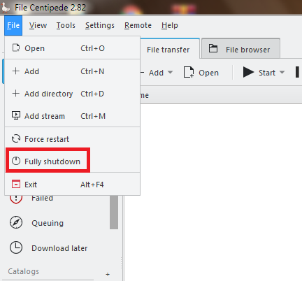
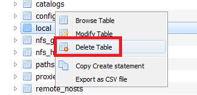
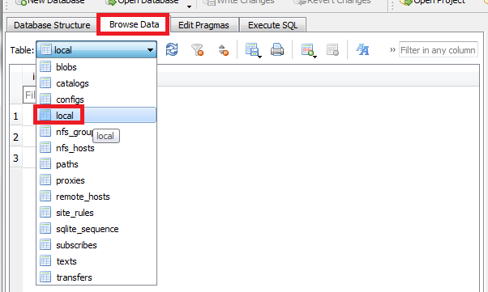
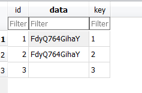
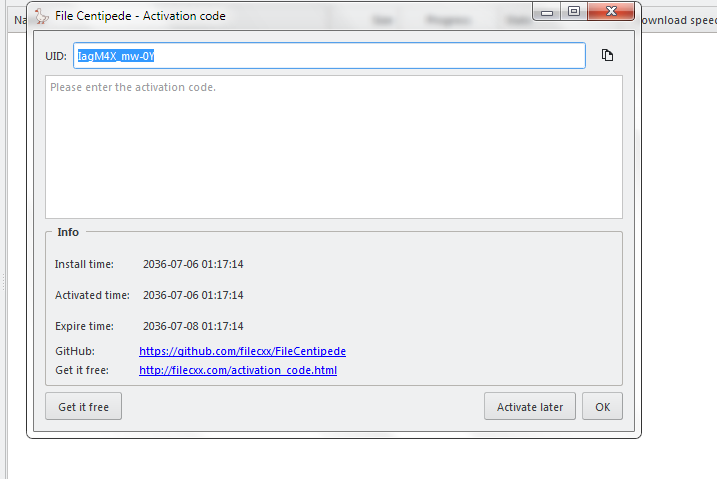

# Xài chùa premium app con Vịt 🦆

🔗 ***Source***: [Link](https://voz.vn/t/tong-hop-software-can-thiet-cho-may-tinh.2974/page-64#post-21105427) - Cảm on ***Fioren***

## 1. Cách hô biến expire time 🧙‍♂️

* Chọn chỗ này để thoát hoàn toàn app

* Sau đó tải app này [DB Browser for SQLite Portable](https://portableapps.com/apps/development/sqlite_database_browser_portable)
* Tải về giải nén các kiểu cài ra được app portabe, chạy nó.
Vào `File ➡ open database chọn file filecxx_xxxxx\lib\data_windows.db`
* Thấy cái table `Local`, `chuột phải ➡ delete table`

* Sau đó bật lại con vịt vào `Help ➡ Activation code` coi số ngày nó reset lại 3 ngày sử dụng chưa.
* Rồi thoát hoàn toàn con vịt như bước đầu tiên
* Mở lại cửa sổ SQL lite ấn F5 nó sẽ hiển thị lại table `Local`
* Tới đây bấm tab `Browse data` chọn `Local`

* Dòng số 1,2 là 2 dãy chữ số giống nhau. Ấn đè kéo cái 2 dòng đó để edit được. Đổi `chữ cái gần cuối cùng thành chữ a`. *Ví dụ: FdyQ764GihkY thành FdyQ764GihaY*

* Sau đó ấn Ctrl + S để save lại

## 📁 File ăn sẵn dành cho ai lười -  [Magic](https://drive.google.com/file/d/1-XQliAgzYFzYa7eu9815PFiSC5DJBXmm/view)

Giải nén copy đè file `data_windows.db` vào `filecxx_xxxxx\lib`
