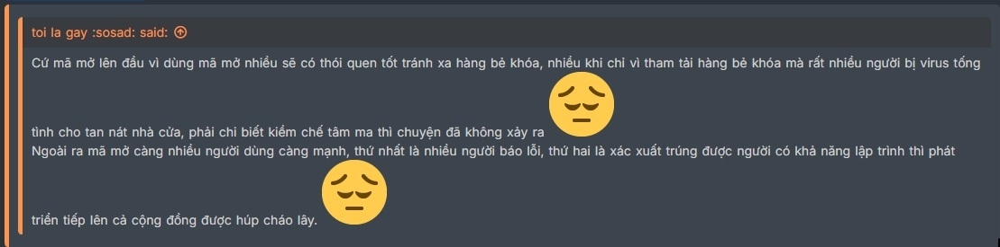

# 📜 **Danh mục phần mềm thiết yếu** 📜

***Tham khảo và trích từ các thớt trên*** [f13](https://voz.vn/f/phan-mem.13/))

🤔 ***Trích lời từ 1 Vozer***:

## 🌍 1. Trình duyệt Web 

😍 ***Phổ biến nhất:***

| Tên | Miêu tả | Mã nguồn mở |
|:---|:---|:---:|
| [Google Chrome](https://www.google.com/chrome/) | Con cưng của Google, sinh ra từ Chromium | ❌ |
| [Microsoft Edge](https://www.microsoft.com/en-us/edge/download) | Cùng họ Chromium | ❌ |
| [Mozilla Firefox](https://www.mozilla.org/en-US/firefox/windows/) | Dành cho những ai muốn sự bảo mật, riêng tư | ❌ |

🤩 ***Lựa chọn thay thế:***

| Tên | Miêu tả | Mã nguồn mở |
|:---|:---|:---:|
| [Cốc Cốc](https://coccoc.com/download) | Tích hợp chặn quảng cáo, bắt link download như IDM | ❌
| [Brave](https://brave.com/download/) | Tích hợp chặn quảng cáo, VPN | ✔ |
| [Vilvadi](https://vivaldi.com/) | Tích hợp chặn quảng cáo | ✔ |
| [Opera](https://www.opera.com/) | Tích hợp chặn quảng cáo, VPN | ❌ |
| [Arc Browser](https://arc.net/) | UI mới lạ, tích hợp nhiều tính năng | ❌ |

## 🏢 2. Phần mềm Office

😍 ***Phổ biến nhất:***

| Tên | Miêu tả | Mã nguồn mở | Trả phí |
|:---|:---|:---:|:---:|
| [Microsoft Office (365)](https://gravesoft.dev/office_c2r_links) | Muốn "cướp biển" thì dùng: [Link](https://massgrave.dev/) | ❌ | ✔ |

🤩 ***Lựa chọn thay thế:***

| Tên | Miêu tả | Mã nguồn mở | Trả phí |
|:---|:---|:---:|:---:|
| [OnlyOffice](https://www.onlyoffice.com/) | App dùng Electron - framework Chromium nên rất tốn RAM | ✔ | ❌
| [SoftMaker FreeOffice](https://www.freeoffice.com/en/) | Chỉ xài được mức cơ bản, nhiều tính năng như chèn phép tính, macro không có | ❌ | ❌ |
| [WPS Office](https://www.wps.com/) | Tương thích với hệ MS khá tốt, tuy nhiên hơi chậm và có nhiều quảng cáo | ❌ | ❌ |
| [LibreOffice](https://www.libreoffice.org/) | Chỉ hỗ trợ tốt hệ Open Document [.ods, .odt, .odp], còn hệ MS Office [.docx, .pptx, .xlsx] không hỗ trợ nhiều lắm | ✔ | ❌ |

## 📁 3. Phần mềm nén/giải nén file/folder 

😍 ***Phổ biến nhất:***

| Tên | Miêu tả | Mã nguồn mở | Trả phí |
|:---|:---|:---:|:---:|
| [7-Zip](https://www.7-zip.org/) | Gọn nhẹ, dù UI hơi cổ | ✔ | ❌ |
| [WinRAR](https://www.win-rar.com/start.html?&L=0) | Muốn "cướp biển" thì dùng: [Link](https://github.com/bitcookies/winrar-keygen) | ❌ | ✔ |

🤩 ***Lựa chọn thay thế:***

| Tên | Miêu tả | Mã nguồn mở | Trả phí |
|:---|:---|:---:|:---:|
| [NanaZip](https://github.com/M2Team/NanaZip) | Bản fork của 7-Zip nhưng giao diện hiện đại hơn | ✔ | ❌ |
| [PeaZip](https://peazip.github.io/) | GUI lấy cảm hứng từ File Explorer của Windows | ✔ | ❌ |

## 📝 4. Phần mềm xem/chỉnh sửa PDF 

😍 ***Phổ biến nhất:***

| Tên | Miêu tả | Mã nguồn mở | Trả phí |
|:---|:---|:---:|:---:|
| [Foxit PDF Reader](https://www.foxit.com/pdf-reader/) | Load file nhanh, ít tính năng | ❌ | ❌ |
| [Adobe Acrobat Reader](https://get.adobe.com/reader/) | Load file không bằng, nhiều tính năng hơn | ❌ | ❌ |

🤩 ***Lựa chọn thay thế:***

| Tên | Miêu tả | Mã nguồn mở | Trả phí |
|:---|:---|:---:|:---:|
| [PDF24](https://www.pdf24.org/en/) | UI đơn giản, khá nhiều chức năng | ❌ | ❌ |
| [Sumatra PDF Reader](https://www.sumatrapdfreader.org/free-pdf-reader) | Chỉ đọc, gọn nhẹ | ✔ | ❌ |
| [Calibre](https://calibre-ebook.com/download) | Trùm quản lý ebook | ✔ | ❌ |

## 🌐 5. Phần mềm download

😍 ***Phổ biến nhất:***

| Tên | Miêu tả | Mã nguồn mở | Trả phí |
|:---|:---|:---:|:---:|
| [Internet Download Manager](https://www.internetdownloadmanager.com/) | Muốn "cướp biển" thì dùng [Link](https://github.com/lstprjct/IDM-Activation-Script) ( cho bản 6.42 trở xuống) | ❌ | ✔ |
| [qBitTorrent](https://www.qbittorrent.org/) | Chỉ bắt torrent | ✔ | ❌ |
| [Neat Download Manager](https://www.neatdownloadmanager.com/index.php/en/) | IDM bản fake, rất nhẹ | ❌ | ❌ |

🤩 ***Lựa chọn thay thế:***

| Tên | Miêu tả | Mã nguồn mở | Trả phí |
|:---|:---|:---:|:---:|
| [Free Download Manager](https://www.freedownloadmanager.org/) | UI đon giản, không bắt được link video | ❌ | ❌ |
| [File Centipede](https://filecxx.com/en_US/index.html) | 🦆 này mạnh, muốn "cướp biển" thì đọc [Link](../Notes/File-Centipede/File-Centipede.md), không thì donate để có premium | ✔ | ❌ |
| [Motrix](https://motrix.app/) | Công dụng như 🦆 nhưng cùi hơn | ✔ | ❌ |
| [JDownloader 2](https://jdownloader.org/home/index) | Khá ngon nhưng khá nặng, bắt link ok | ✔ | ❌ |
| [Xtreme Download Manager](https://xtremedownloadmanager.com/) | Công dụng như IDM nhưng không bằng | ✔ | ❌ |
| [Hitomi Downloader](https://github.com/KurtBestor/Hitomi-Downloader) | Công dụng như IDM nhưng không bằng | ✔ | ❌ |
| [uGet Downloader](https://ugetdm.com/) | Bản GUI của [aria2](https://aria2.github.io/) | ✔ | ❌ |
| [TarTube](https://github.com/axcore/tartube) | Bản GUI của [yt-dlp](https://github.com/yt-dlp/yt-dlp) | ✔ | ❌ |

## 📦 6. Phần mềm App Uninstaller

😍 ***Phổ biến nhất:***

| Tên | Miêu tả | Mã nguồn mở | Trả phí |
|:---|:---|:---:|:---:|
| [Revo Uninstaller](https://www.revouninstaller.com/revo-uninstaller-free-download/) | App khá tốt, UI/UX ổn áp, muốn xài chùa PRO thì có [Link](https://mega.nz/file/r5IGCB7K#ugPbo8ztvhSOCh5kkwOP83t4w7YQFj9MYtOkIUGieyo) | ❌ | ❌ |

🤩 ***Lựa chọn thay thế:***

| Tên | Miêu tả | Mã nguồn mở | Trả phí |
|:---|:---|:---:|:---:|
| [HiBit Uninstaller](https://www.hibitsoft.ir/Uninstaller.html) | UI/UX chưa thân thiện, có cả bản portable | ❌ | ❌ |
| [BulkCrap Uninstaller](https://www.bcuninstaller.com/) | Có các tính năng như đánh dấu nguồn, dò leftovers | ✔ | ❌ |
| [Geek Uninstaller](https://geekuninstaller.com/) | Có các tính năng như đánh dấu nguồn, dò leftovers | ❌ | ❌ |

## ⌨ 7. Phần mềm gõ tiếng Việt

😍 ***Phổ biến nhất:***

| Tên | Miêu tả | Mã nguồn mở | Trả phí |
|:---|:---|:---:|:---:|
| [Unikey](https://www.unikey.org/) | Một trong các bộ gõ phổ biến từ Windows XP | ✔ | ❌ |
| [EVKey](https://evkeyvn.com/) | Bản cải tiến từ UniKey từ 1 Vozer | ✔ | ❌ |
| [OpenKey](https://open-key.org/) | Tính năng y như EVKey | ✔ | ❌ |

🤩 ***Lựa chọn thay thế:***

| Tên | Miêu tả | Mã nguồn mở | Trả phí |
|:---|:---|:---:|:---:|
| [GoTiengViet](https://www.trankynam.com/gotv/) | Tính năng không bằng EVKey, OpenKey | ❌ | ❌ |

## 💻 8. Phần mềm điều khiển thiết bị từ xa

😍 ***Phổ biến nhất:***

| Tên | Miêu tả | Mã nguồn mở | Trả phí |
|:---|:---|:---:|:---:|
| [UltraViewer](https://www.ultraviewer.net/vi/download.html) | Miễn phí cho mục đích cá nhân | ❌ | ❌ |
| [TeamViewer](https://www.teamviewer.com/vi/download/windows/) | Miễn phí cho mục đích cá nhân | ❌ | ❌ |

🤩 ***Lựa chọn thay thế:***

| Tên | Miêu tả | Mã nguồn mở | Trả phí |
|:---|:---|:---:|:---:|
| [AnyDesk](https://anydesk.com/en) | Miễn phí cho mục đích cá nhân | ❌ | ❌ |
| [Parsec](https://parsec.app/downloads) | Miễn phí cho mục đích cá nhân | ❌ | ❌ |
| [guiscrcpy](https://github.com/srevinsaju/guiscrcpy) | Bản GUI của [scrcpy](https://github.com/Genymobile/scrcpy) | ✔ | ❌ |
| [RustDesk](https://rustdesk.com/index.html) | Miễn phí cho mục đích cá nhân | ✔ | ❌ |
| [Chrome Remote Desktop](https://remotedesktop.google.com/) | Hàng của Google, xài rất ok | ❌ | ❌ | 
