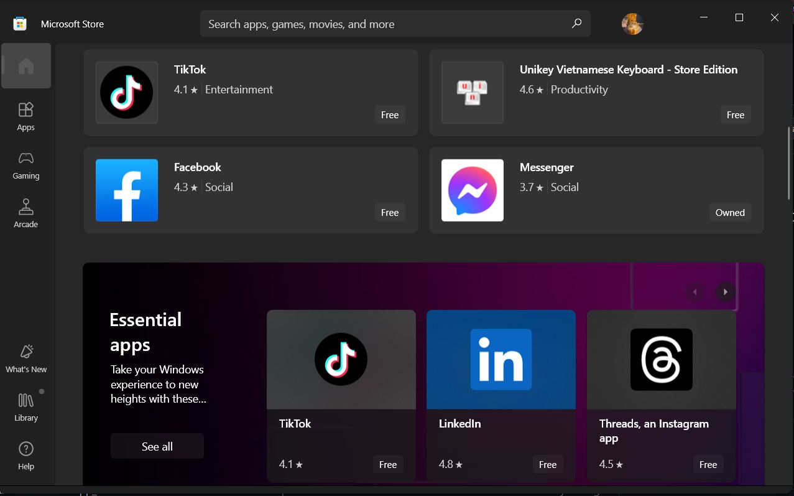

# 💽 **Windows 10/11 LTSC Installation** 💽

## **1. 💾 Ventoy**


❗ *Yêu cầu: USB 8gb đổ lên hoặc box HDD/SSD*

Mấy fen có bao giờ phải tạo nhiều USB boot khác nhau để cài đặt các hệ điều hành khác nhau như Windows 10/11, Ubuntu,... chưa? Với Ventoy,  chỉ cần một chiếc USB duy nhất là có thể khởi động vào nhiều hệ điều hành khác nhau một cách dễ dàng.

Sau khi cài đặt Ventoy trên USB hoặc box HDD/SSD, mấy fen có thể sao chép các file ISO (file cài đặt của hệ điều hành) vào đó. Sau đó mấy fen chỉ việc boot USB lên và chọn file ISO cần để chạy. Đơn giản, nhanh gọn lẹ

Ngoài ra mấy fen có thể lưu dữ liệu vào đó song song với các file ISO bằng cách tạo 1 folder chứa dữ liệu của các thím rồi tạo file `.ventoyignore`, khi Ventoy chạy nó sẽ bỏ qua folder chứa file đó

🔗 ***Trang chủ*** : [Ventoy](https://ventoy.net/en/index.html)

📄 ***Hướng dẫn***: [Link](https://quantrimang.com/cong-nghe/cach-tao-usb-boot-bang-ventoy-182876)

📺 ***Quá lười để đọc?*** Xem [video](https://www.youtube.com/watch?v=06OJwQfCmYY)

📄 ***Cách vào menu boot các dòng laptop/desktop***: [Link](https://www.thegioididong.com/hoi-dap/cach-vao-bios-va-menu-boot-cua-tat-ca-cac-dong-laptop-1229783)

🖼️ ***Screenshot*:** [Screenshot](https://ventoy.net/en/screenshot.html)

## **2. 💿 Windows 10/11 LTSC ISO**


### 🤔 *Lý do nên cài bản LTSC (Long-term Servicing Channel) ?*

- *Hỗ trợ dài hạn (10 năm) thay vì các bản thông thường (5 năm)*
- *Ít cập nhật hơn các bản thông thường nên tính ổn định cao*
- *Được gọi là bản Win sạch đúng nghĩa vì không có bloatware/app rác*
- *Không có mấy cái quảng cáo khó chịu của Windows*
- *Có thể tuỳ chỉnh tuỳ theo nhu cầu mỗi người*

❗ ***Chú ý: Windows 10 LTSC 2021 sẽ dừng hỗ trợ vào ngày 12 tháng 1 năm 2027***

🔗 ***Download*:** [ISO](https://massgrave.dev/windows_ltsc_links)

### 😋 *Bỏ qua đăng nhập tài khoản Microsoft trong khi cài đặt Windows 11*

🖥️ **Ngắt kết nối Internet**

- Gõ tổ hợp `Shift + F10` để mở Command Prompt.
- Copy dòng lệnh dưới đây để ngắt kết nối mạng và nhấn `Enter`:

``` powershell
 OOBE\BYPASSNRO
```

- Windows sẽ khởi động lại và nhấn vào tuỳ chọn `I don't have Internet`
- Sau đó tiếp tục nhấn `Continue with limited setup` để hoàn thành cài đặt.

📧 **Sử dụng email ảo**

- Nhập một trong các email dưới đây:  
  
``` email
 no@thankyou.com
 a@a.com
 test@test.com
```

- Mật khẩu cũng pha ke nốt nên nhập vài kí tự cho có.
- Một thông báo lỗi xuất hiện. Nhấn `Next` và thiết lập tài khoản cục bộ như bình thường.

## **3. 💻 Microsoft Activation Scripts (MAS)**


Tool kích hoạt Windows / Office sử dụng phương pháp kích hoạt HWID / Ohook / KMS, mã nguồn mở, an toàn 

📄 ***Trang chủ*:** [Link](https://massgrave.dev/)

Gõ tổ hợp `⊞ Win + X` và chọn `Powershell/Terminal (Admin privileges)`, copy dòng lệnh dưới đây và làm theo hướng dẫn của tool

``` powershell
irm https://get.activated.win | iex
```

🖼️ ***Screenshot*:** [Link](https://massgrave.dev/#screenshots)

## **4. 🖥 Cài đặt Windows Store (LTSC mặc định không có khi cài đặt)**



🔗 ***Link cài đặt Windows Store:*** [GitHub](https://github.com/kkkgo/LTSC-Add-MicrosoftStore)

✅ ***VirusTotal:*** [Link](https://www.virustotal.com/gui/file/9e3eaa5f3bb28cf022a753df99ab95c717457e27e85fd1ca14d69e38b7f8c168?nocache=1)

Giải nén ra rồi chạy file Add-Store.cmd, nhớ đọc file README trước khi chạy
