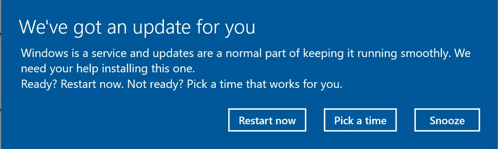
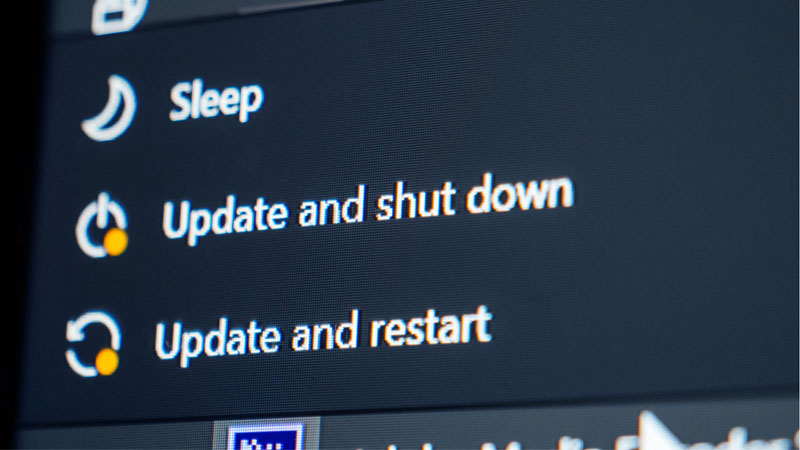
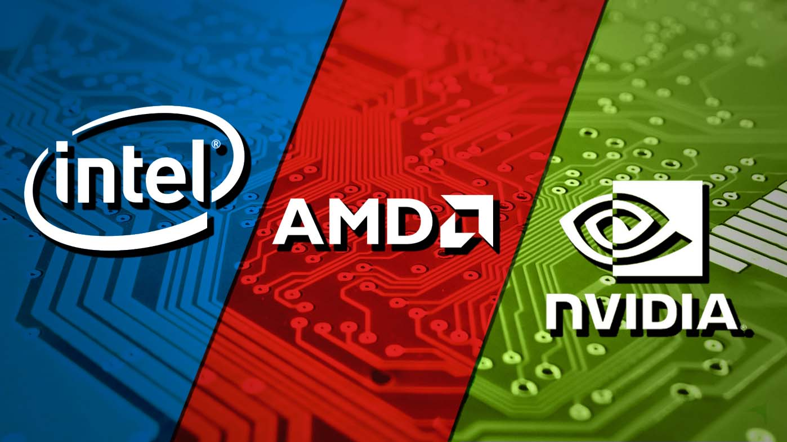
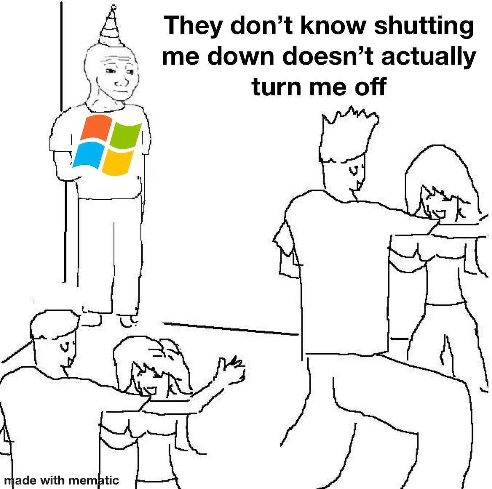
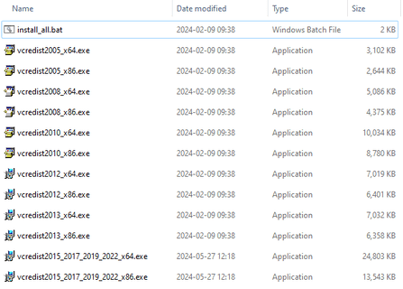

# 📀 **Sau khi cài đặt Windows** 📀

## 💻 1. Tắt tự động cập nhật Windows

Một ngày đẹp trời, mấy fen đang dùng thì Windows cho ra ba cái thông báo phiền phức như này 🤬

hoặc như này 🤬 khi mấy fen muốn shutdown máy.

Khó chịu 😡? Có vài cách để tắt tự động cập nhật Windows, nhưng mình sẽ nói về các cách phổ biến nhất 😍.

Ah ❗, Mấy fen nên cài driver cho các thiết bị ngoại vi như WiFi / Bluetooth / LAN adapters 📶 trước khi tinh chỉnh Windows Update.

* ### 💾 [Windows Update Blocker by Sordum](https://www.sordum.org/9470/windows-update-blocker-v1-8/)

🔗 ***Dự phòng***: [Internet Archive](https://archive.org/details/windows-update-blocker-1.8-by-sordum)

✅ ***VirusTotal***: [Link](https://www.virustotal.com/gui/file/a094805ad7530fba95ca68fe8dd061ff2c36447a4dca660229cd4a3602c3371d)

Một tool chặn Windows Update đơn giản, tuy nhiên mình không khuyến khích dùng cho lắm vì nó không có tuỳ chỉnh cài đặt cập nhật

* ### 💾 [Windows Update Mini Tool 22.04.2022](https://www.majorgeeks.com/files/details/windows_update_minitool.html)

🔗 ***Dự phòng***: [Internet Archive](https://archive.org/details/windows-update-mini-tool-22.04.2022)

✅ ***VirusTotal***: [Link](https://www.virustotal.com/gui/file/1bd6fbd5e65d9e88f47cb43f60e0e694b702513fde26afb18a0d1396bcb7307d)

Tool này ngoài việc nó có thể tuỳ chỉnh Windows Update còn có thể tuỳ chọn các bản cập nhật, mình đang dùng nó để tắt tự động cập nhật và update bằng tay.

## 💽 2. Intel/AMD/NVDIA Driver

Windows Update có một cái rất dở là driver của Intel / AMD / NVDIA của nó không phải là hàng "chuẩn", dễ lỗi, tính ổn định không cao nên thường không được tin cậy cho lắm. Vì thế mấy fen nên tải driver của 3 hãng đó từ web chính chủ cho ổn áp

Dưới đây là các tool hỗ trợ cài đặt driver từ  Intel / AMD / NVIDIA.

* 🖥 ***Intel***: [Download Center](https://www.intel.com/content/www/us/en/download-center/home.html)

* 🖥 ***AMD***: [Download Center](https://www.amd.com/en/support/download/drivers.html)

* 🖥 ***NVDIA***: [Download Center](https://www.nvidia.com/download/index.aspx)

❗ Thông thường các bản driver mới nhất không phải bản nào cũng ổn định, vì thế mấy fen nên tự nghiên cứu bản nào ổn định nhất theo cấu hình máy của mấy fen

### 🤔 *Làm thế nào để downgrade bản driver?*

Dùng tool này, cái này thì thiên hạ ai cũng dùng nên không cần bàn cãi, ngoài ra còn có tính năng chặn driver từ Windows Update.

* ### 💾 [Display Driver Uninstaller of WagnardSoft](https://www.wagnardsoft.com/forums/viewtopic.php?t=4992)

📄 ***Trang chủ:*** [Link](https://www.wagnardsoft.com/content/How-use-Display-Driver-Uninstaller-DDU-Guide-Tutorial)

📺 ***Quá lười để đọc?*** Xem [video](https://www.youtube.com/watch?v=q7z7VZ3SHs8)

Cài driver bản mấy fen muốn cài sau khi gỡ driver bản cũ.

❗ Trước khi thoát `Safe Mode`, `TẮT TỰ ĐỘNG CẬP NHẬT WINDOWS` để tránh việc Windows Update tự ý cập nhật driver

## 🖥 3. Tắt Fast Startup Windows 10/11

### 🤔 *Có nên tắt Fast Startup không ?*

Hồi xưa, khi mà SSD (Solid State Drive) chưa phổ biến, HDD (Hard Disk Drive) được sử dụng đa số từ Windows tới MacOS, đương nhiên thời đó tốc độ khá là chậm nên bật Windows 10 trở đi là một cực hình khi khởi động rất lâu (trung bình 30s -> 60s), nên Fast Startup là một "cứu cánh" cho máy xài HDD khi mà giảm thời gian khởi động rất nhiều. 🤩

Thời nay, người người nhà nhà xài SSD, giá thành không đắt như trước, thì tính năng này khá là thừa thãi khi chỉ bật máy nhanh hơn vài giây, chưa kể có những tranh cãi về việc SSD bị giảm tuổi thọ khi dùng tính năng này 🤨

Bản chất của Fast Startup là tính năng "lai" giữa Sleep và Hibernation của Windows, nên tính năng này không hoàn toàn shutdown máy, thành ra có khả năng tiềm tàng sinh ra các bug ảo ma canada, chưa kể mấy fen không "dual boot" được chừng nào tính năng này còn bật 🤨

Tuỳ với nhu cầu mỗi người, nhưng với mình là tắt. 😏

📺 Muốn tìm hiểu thêm? Xem [video](https://www.youtube.com/watch?v=QnBrv2wuSOg)

### 🤔 *Phân biệt giữa Fast Startup và Hibernation?*

📰 ***Phân tích của Microsoft:*** [Document](https://learn.microsoft.com/en-us/windows-hardware/drivers/kernel/distinguishing-fast-startup-from-wake-from-hibernation)

### 🤔 *Làm thế nào để tắt Fast Startup?*

📄 ***Hướng dẫn:*** [Link](https://quantrimang.com/vo-hieu-tuy-chon-fast-startup-tren-windows-8-91957)

📺 ***Quá lười để đọc?*** Xem [video](https://www.youtube.com/watch?v=l0rTG7b5sGc)

## 🖥 4. Cài đặt Codec Media Windows

### 🤔 *Tại sao nên cài Codec Media Windows?*

Rất đơn giản, không có mấy cái đó thì các browser (Chrome, Edge,...) sẽ không thể chạy hardware acceleration (tăng tốc phần cứng) hiệu quả được. Ví dụ như hình trên là sau khi cài các codec của Windows.

📄 ***Codec là gì?*** [Link](https://www.thegioididong.com/hoi-dap/codec-la-gi-co-quan-trong-khong-may-tinh-can-bao-nhieu-1370538)

Cách cài đặt rất đơn giản, tải file .zip vê, giải nén rồi chạy cài đặt từng codec trong đó là được

🔗 ***Download***: [Codec Media Windows](https://mega.nz/file/XgIyxbia#2gt-w5FVy-1uQxShcjth9z5lrC2XfKBwZUALFiMq9p0)

✅ ***VirusTotal***: [Link](https://www.virustotal.com/gui/file-analysis/ZDRiNjhhM2FjNmZiN2QyNzA2NjQ3M2NhYjIyZjcyNjM6MTcyMjY2MjUwNQ==)

## 🖥 5. Cài đặt Microsoft Visual C++ Redistributable AIO

### 🤔 *Tại sao nên cài Microsoft Visual C++ Redistributable?*

Nó là một "runtime" (hệ thống thực thi) cần thiết cho việc chạy các app Windows, thiếu nó thì chắc chắn khi chạy app/game sẽ báo các lỗi thiếu file .dll này nọ, nên việc cài nó là rất cần thiết.

📄 ***Visual C++ là gì?*** [Link](https://fptshop.com.vn/tin-tuc/danh-gia/microsoft-visual-c-la-gi-168166)

Cách cài đặt rất đơn giản, tải file .zip vê, giải nén và chạy file `install_all.bat` là được

🔗 ***Visual C++ Redistributable AIO by TechPowerUp***: [Download](https://www.techpowerup.com/download/visual-c-redistributable-runtime-package-all-in-one/)

✅ ***VirusTotal***: [Link](https://www.virustotal.com/gui/file/b9e2daf2a76b3d7dbac2a657cd4a2ffa5c0052b01fc955088e988f6eea91f934)