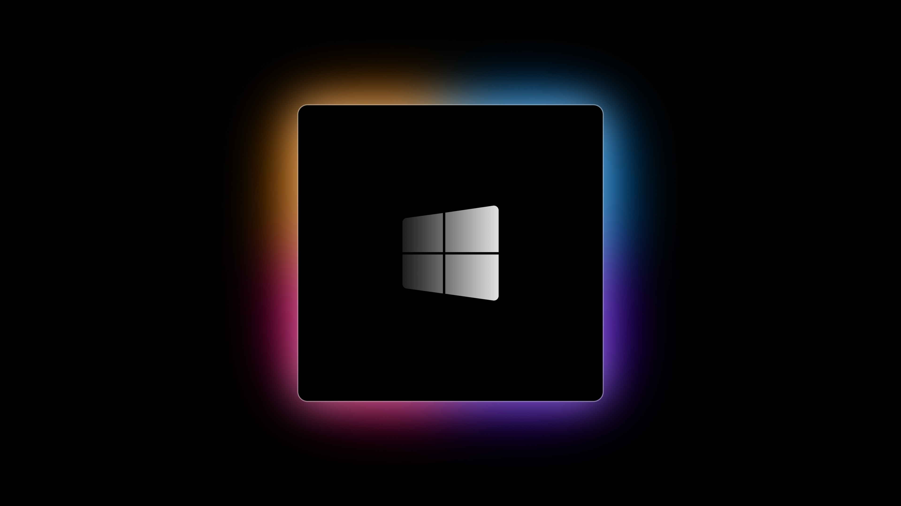

# 📒 **Hướng dẫn tổng hợp tối ưu Windows** 📒

--- 👨‍💻 *Tác giả:* [SmithWinter](https://voz.vn/u/smithwinter.1715938/) ---

--- ❗ *Lưu ý: Hướng dẫn chỉ hướng tới các thiết bị Windows cá nhân* ---

Một ngày, mấy fen thấy cái máy chậm và lag hơn rùa bò, hay chỉ là muốn cho cái máy một khởi đầu mới. Nhân lúc rảnh rỗi mấy bác quyết định "reset" cái máy và thế là mấy thớt tìm các "tút" về Windows trên Google 😁

Có những "thớt" như vậy trên các diễn đàn công nghệ "đầu hàng" như VoZ, VN-Zoom, TinhTe,... Những "thớt" này được tổng hợp trong thời gian rất dài, đương nhiên muốn tìm kiếm phải lăn qua chỗ này chỗ kia, hay phải "đánh dấu" để chống trôi, ai chứ riêng mình thì lười lắm

Vì thế chiếc hướng dẫn này sinh ra để tổng hợp lại các "tút" về Windows dựa vào số lượng vô cực các "thớt" trên 4rum và GitHub, đương nhiên là viết trên GitHub vì mình muốn ai cũng có thể "fork" về và đóng góp dựa trên trải nghiệm cá nhân của mỗi người

"Thớt" này được viết bằng Markdown và dựng trên GitHub Page, hướng tới mọi đối tượng

Luôn nhớ  ❗❗❗ `SAO LƯU DỮ LIỆU` ❗❗❗ trước khi tuỳ chỉnh để tránh mất mát không đáng có

## 1. 📔 [Cài đặt Windows 10/11 LTSC](./Pages/Windows-LTSC-Installation.md)

📝 Phần này sẽ hướng dẫn mấy fen cài đặt và kích hoạt Windows 10/11 LTSC.

## 2. 📔 [Sau khi cài đặt Windows](./Pages/Windows-Post-Install.md)

📝 Phần này sẽ hướng dẫn mấy fen giai đoạn sau khi cài đặt và kích hoạt Windows.

## 3. 📔 [Danh mục phần mềm thiết yếu](./Pages/Essential-Software-Category.md)

📝 Phần này liệt kê các phần mềm cho Windows, mình sẽ ưu tiên freemium/shareware mã nguồn mở, sau đó là trả phí. Tool "cướp biển" trả phí 1 là open source, còn 2 là license file (có up VirusTotal) + tinh chỉnh registry, khá là an toàn

## 4. 📔 [Danh sách các flag hữu ích cho trình duyệt họ Chromium](./Pages/Chromium-Flag.md)

📝 Phần này liệt kê những flag (tính năng ẩn) hữu ích trong trình duyệt họ Chromium để trải nghiệm lướt web tốt hơn