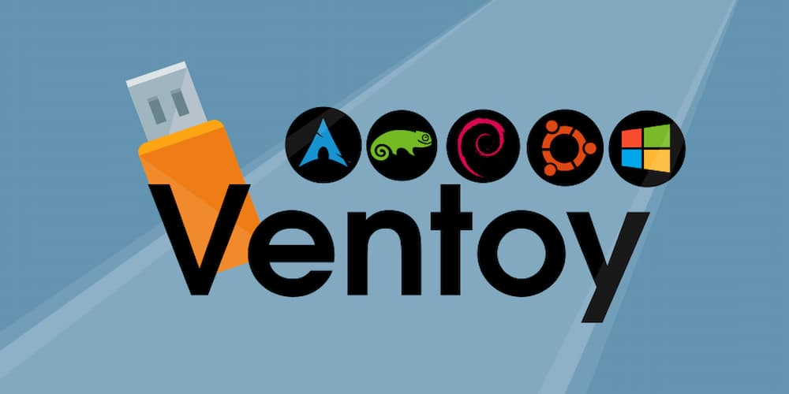
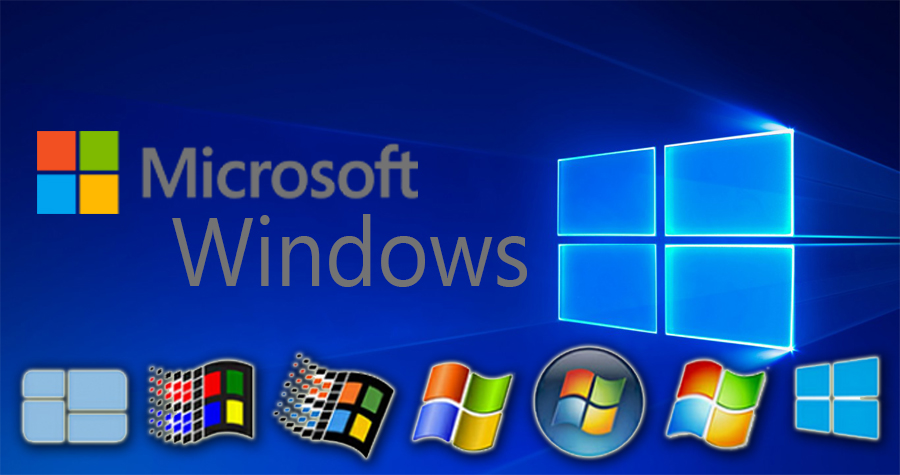
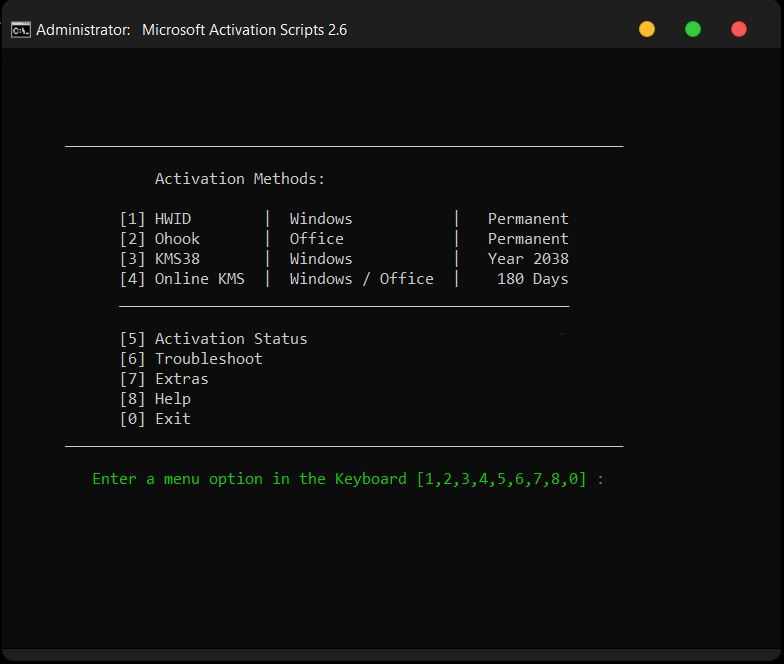

# 💽 **Windows 10/11 LTSC Installation** 💽

## **1. 💾 Ventoy**



Ventoy is an open-source tool designed to create bootable USB drives for operating systems. Unlike traditional methods that require formatting the USB drive and copying the OS files each time, Ventoy allows users to simply copy ISO, WIM, IMG, VHD, or EFI files to the USB drive and boot from them directly. This makes it a versatile and convenient solution for managing multiple operating system installations or live environments from a single USB drive.

❗ *Requirement: An USB stick >8gb space*

🔗 ***Download*** : [Ventoy](https://ventoy.net/en/index.html)

📄 ***Getting Started***: [Document](https://www.ventoy.net/en/doc_start.html)

📺 Prefer a video tutorial? Watch this [video](https://www.youtube.com/watch?v=gAnA7X8fAGs)

After install Ventoy into USB you are free to copy ISO into it

To test it, restart your computer, access the boot menu then select the USB drive

📄 ***If you enable Secure Boot support when install Ventoy***: [Document](https://www.ventoy.net/en/doc_secure.html)

📄 ***Access boot menu***: [Wikihow](https://www.wikihow.com/Get-to-the-Boot-Menu-on-Windows)

🖼️ ***Screenshot*:** [Screenshot](https://ventoy.net/en/screenshot.html)

## **2. 💿 Windows 10/11 LTSC ISO**



### 🤔 *Why LTSC (Long-term Servicing Channel) ?*

- *Long-term support (10 years) comparing to general channel which supports 5 years*
- *High stability/less update*
- *No preinstalled bloatware/trash app*
- *No annoying ads/pop-up* 

❗ ***Note: Windows 10 LTSC EOL at January 12, 2027***

🔗 ***Download*:** [ISO](https://massgrave.dev/windows_ltsc_links)

### 😋 *Windows 11 Bypass Login Requirement during installation*

🖥️ **Command line method**

- Use the "Shift + F10" keyboard shortcut to open Command Prompt.
- Type the following command to release the current network configuration and press Enter:

``` powershell
 oobe\bypassnro
```

- Computer will boot automatically, and you may need to start the out-of-box experience again.
- Click the "*I don't have internet*" option.

📧 **Fake email method**

- Type one of those email:  
  
``` email
 no@thankyou.com
 a@a.com
 test@test.com
```

- Password just type some random characters.
- It will popup error and let you create offline account.

## **3. 💻 Microsoft Activation Scripts (MAS)**



A Windows and Office activator using HWID / Ohook / KMS38 / Online KMS activation methods, with a focus on open-source code and fewer antivirus detections.

📄 ***Getting Started*:** [Document](https://massgrave.dev/)

Press `⊞ Win + X` shortcut and select Powershell/Terminal (Admin privileges), copy this command, then following on-screen instructions

``` powershell
irm https://get.activated.win | iex
```

🖼️ ***Screenshot*:** [Link](https://massgrave.dev/#screenshots)
